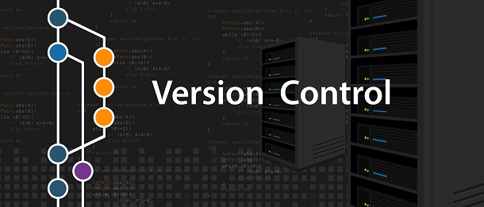

# ¿Qué es el Control de Versiones?

Un **sistema de control de versiones (VCS)** es una herramienta que registra los cambios realizados en un archivo o proyecto a lo largo del tiempo, permitiendo volver a versiones anteriores cuando sea necesario.

### Ventajas principales:
* **Recuperación:** Permite revertir archivos o el proyecto entero a un estado previo si ocurre un error o se pierden datos.
* **Historial de cambios:** Facilita comparar diferencias a lo largo del tiempo.
* **Trazabilidad:** Permite identificar quién hizo una modificación, cuándo se introdujo un cambio o quién provocó un fallo.

